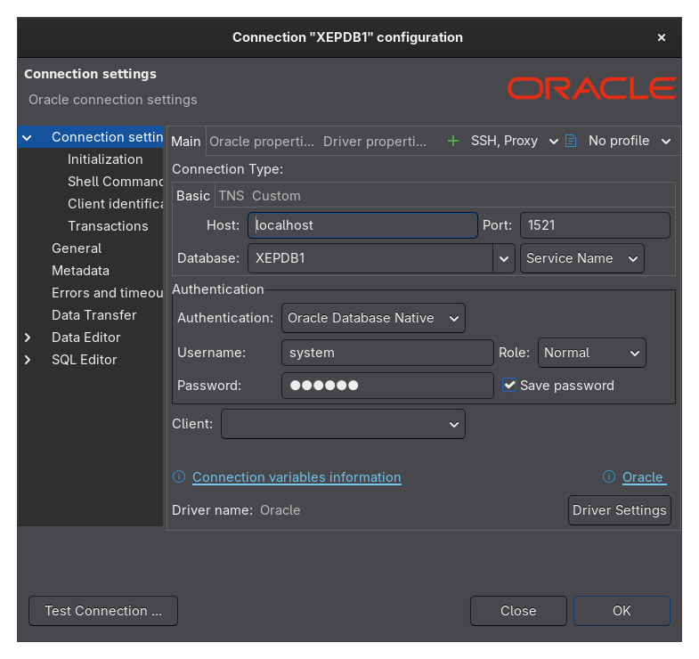

# Oracle XE com Docker Compose

Este projeto utiliza Docker Compose para subir um ambiente Oracle XE com schemas de exemplo (HR, OE, SH).

## Como rodar o ambiente

1. Certifique-se de ter o Docker e o Docker Compose instalados.
2. No terminal, navegue até a pasta de versão específica:

```bash
cd oracle-xe-18c
```

3. Execute o comando abaixo para construir e iniciar os containers:

```bash
docker compose up -d --build
```

- O parâmetro `--build` garante que a imagem será reconstruída caso haja alterações no Dockerfile ou nos scripts.
- O parâmetro `-d` executa os containers em segundo plano.

4. Para acompanhar os logs do container Oracle:

```bash
docker logs <nome-ou-id-do-container>
```

Exemplo:
```bash
docker logs oracle-xe-18c
```

5. Para parar e remover os containers:

```bash
docker compose down
```

6. Se conectar pelo DBeaver:

- Usuário: system
    - Host: localhost
    - Porta: 1521
    - SID: XEPDB1
    - Senha: oracle


---

- Usuário: hr, oe, sh
    - Host: localhost
    - Porta: 1521
    - SID: XEPDB1
    - Senha: hr, oe, sh


## Observações
- Os scripts de inicialização e schemas são executados automaticamente na primeira inicialização.
- Se precisar reinicializar o banco, remova os volumes, imagens e containers antes de subir novamente.
- Consulte os arquivos de log para verificar se os schemas foram instalados corretamente.
